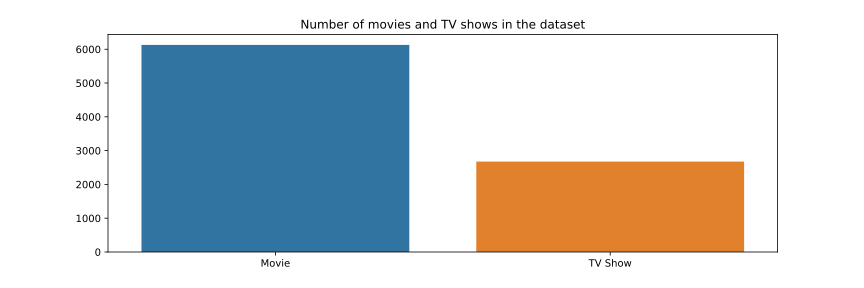
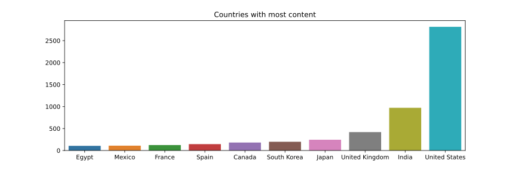
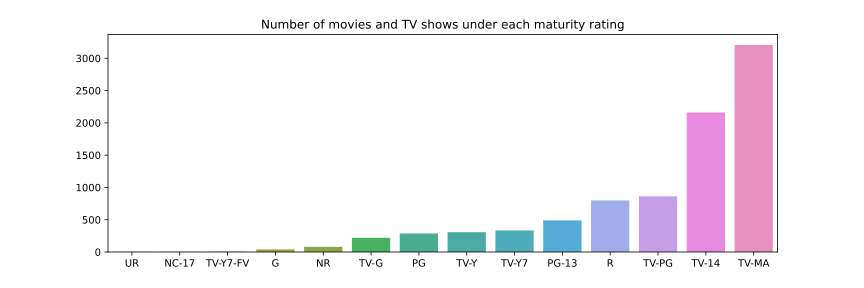
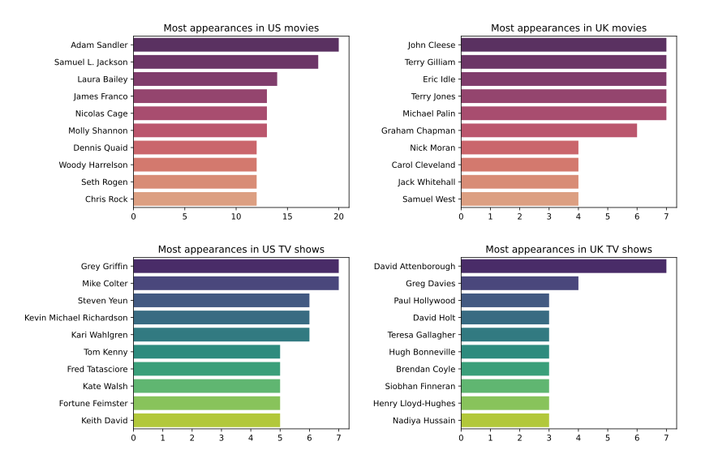

# Netflix Movies and TV Shows

## *Table of Contents*

1. [Introduction](#introduction)
2. [Project Overview](#project-overview)
3. [Data](#data)
4. [Resources](#resources)
5. [Analysis](#analysis)

## *Introduction*

- Netflix, Inc. is an American subscription streaming service and production company
- It was founded in 1997 by Reed Hastings and Marc Randolph in Scotts Valley, California
- Netflix initially both sold and rented DVDs by mail
- However, the sales were eliminated within a year to focus on the DVD rental business
- The company expanded to Canada in 2010, followed by Latin America and the Caribbean
- Netflix entered the content production industry in 2013, debuting its first series House of Cards
- In January 2016, it expanded to an additional 130 countries and then operated in 190 countries
- As of December 31, 2021, Netflix had over 221.8 million subscribers worldwide

## *Project Overview*

- In this project we will perform exploratory data analysis
- Our goal is to obtain information about the content that was available on Netflix until 2021
- For our analysis, we will try to answer some questions which can be found in the [analysis](#analysis) section

## *Data*

- The data were acquired from [kaggle](https://www.kaggle.com/datasets/shivamb/netflix-shows)
- However, originally, they were collected from [Flixable](https://flixable.com/), which is a third-party search engine
- The dataset consists of movies and TV shows that were available on the Netflix platform until 2021
- It includes meta-details about movies and TV shows such as title, director, cast, release year, duration etc.

## *Resources*

- Packages: `pandas`, `matplotlib`, `seaborn`, `missingno`
- Software: Jupyter Notebook

## *Analysis*

We explored the content of the platform by answering the following questions:
- Who directed "Breaking Bad" and who was the star actor?
- In which year were the most movies and TV shows released?
- How many movies and TV shows are in the dataset?
- What are the top 10 genres of movies and TV shows respectively?
- Show all the movies that were released in 2000
- What are the top 10 countries with most content?
- Show all the TV shows that were released in any nordic country
- Show the top 10 directors with most movies and TV shows in Netflix
- Show all comedy movies starring either Jim Carrey or Jackie Chan
- What are the different ratings defined by Netflix?
- What is the duration of the longest movie?
- Show the top 5 longest movies
- What is the average duration of a movie?
- What are the TV shows released between 2010-2015 with at least 5 seasons?
- Show the actors with most appearances in movies and TV shows in US and UK

Below you may find some of the analysis results.

